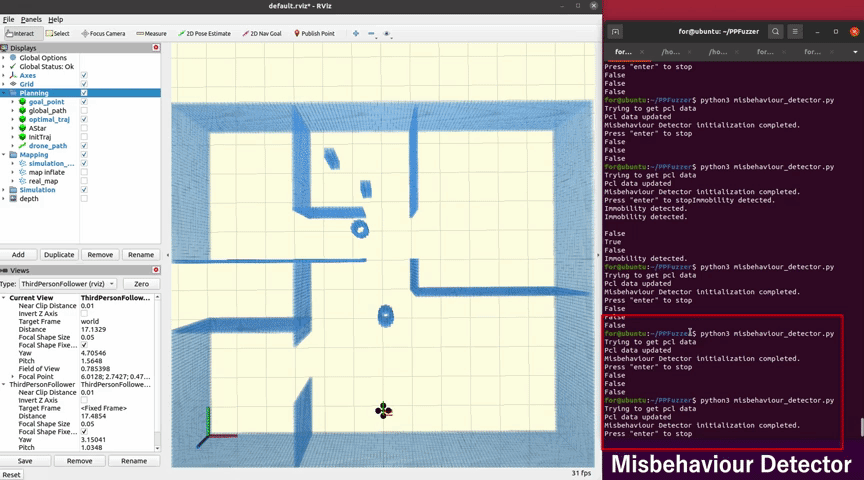
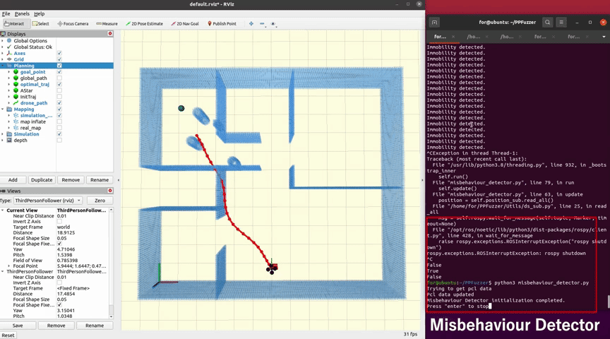
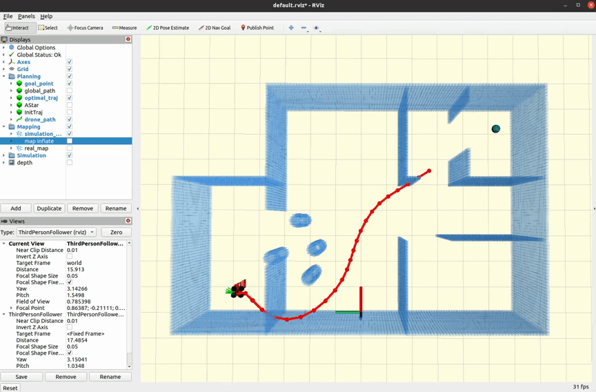
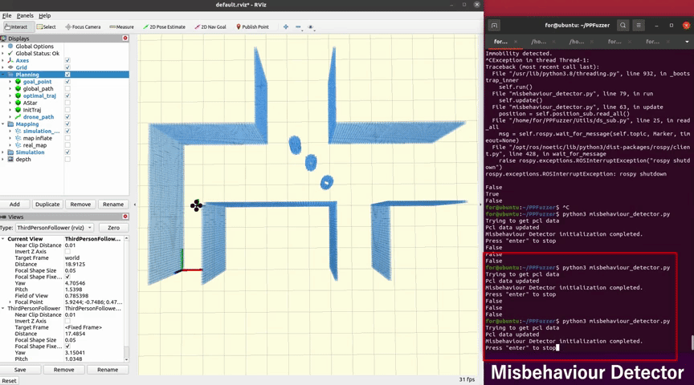
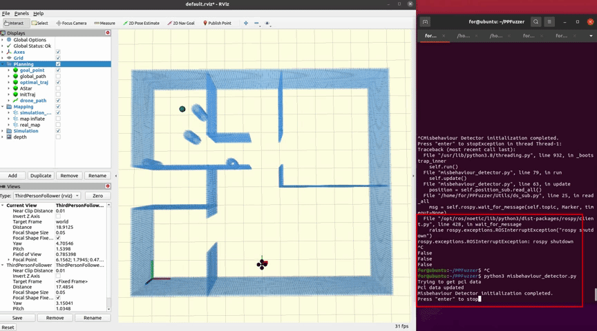
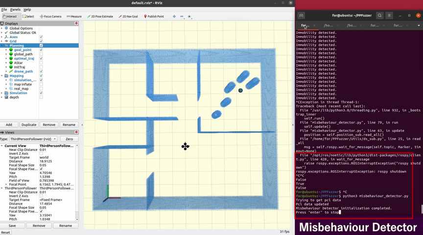
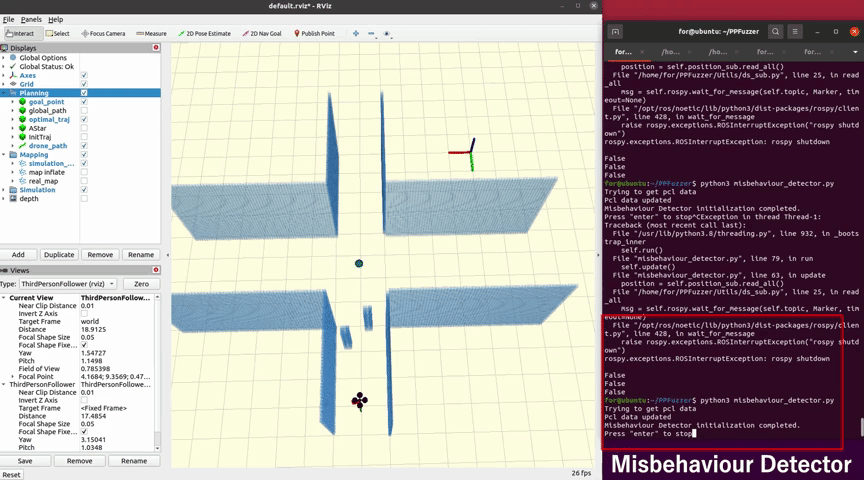
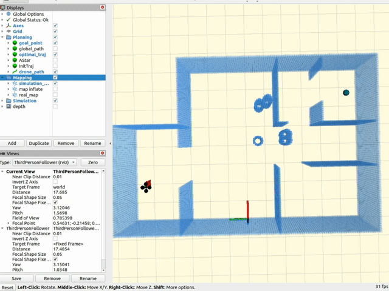
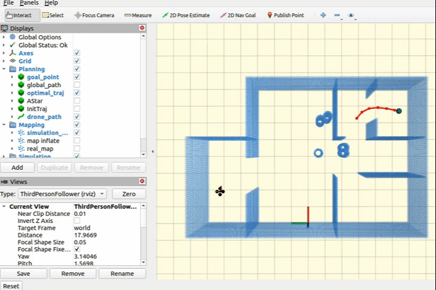

Details about path planners we investigated are available in `investigated_planners` directory.

# RQ1
Code for replaying these scenarios is available in `RQ1` directory.

## Videos

### 8 types of vulnerabilities

<p align = "center">
<div style="position: relative; display: inline-block;">
  <div style="position: absolute; top: 0; left: 0; background-color: rgba(255, 255, 255, 0.9); padding: 8px;">
    <b style="font-size: 32px;">#1</b>
  </div>
  
</div>

<div style="position: relative; display: inline-block;">
  <div style="position: absolute; top: 0; left: 0; background-color: rgba(255, 255, 255, 0.9); padding: 8px;">
    <b style="font-size: 32px;">#2</b>
  </div>
  
</div>
</p>

<p align = "center">
<div style="position: relative; display: inline-block;">
  <div style="position: absolute; top: 0; left: 0; background-color: rgba(255, 255, 255, 0.9); padding: 8px;">
    <b style="font-size: 32px;">#3</b>
  </div>
  
</div>

<div style="position: relative; display: inline-block;">
  <div style="position: absolute; top: 0; left: 0; background-color: rgba(255, 255, 255, 0.9); padding: 8px;">
    <b style="font-size: 32px;">#4</b>
  </div>
  
</div>
</p>

<p align = "center">
<div style="position: relative; display: inline-block;">
  <div style="position: absolute; top: 0; left: 0; background-color: rgba(255, 255, 255, 0.9); padding: 8px;">
    <b style="font-size: 32px;">#5</b>
  </div>
  
</div>

<div style="position: relative; display: inline-block;">
  <div style="position: absolute; top: 0; left: 0; background-color: rgba(255, 255, 255, 0.9); padding: 8px;">
    <b style="font-size: 32px;">#6</b>
  </div>
  
</div>
</p>

<p align = "center">
<div style="position: relative; display: inline-block;">
  <div style="position: absolute; top: 0; left: 0; background-color: rgba(255, 255, 255, 0.9); padding: 8px;">
    <b style="font-size: 32px;">#7</b>
  </div>
  
</div>

<div style="position: relative; display: inline-block;">
  <div style="position: absolute; top: 0; left: 0; background-color: rgba(255, 255, 255, 0.9); padding: 8px;">
    <b style="font-size: 32px;">#8</b>
  </div>
  
</div>
</p>

# RQ2
Data in RQ2 is available in `RQ2` directory.

# RQ3
### \#1 vulnerability
<p align = "center">
<div style="position: relative; display: inline-block;">
  <div style="position: absolute; top: 0; left: 0; background-color: rgba(255, 255, 255, 0.9); padding: 8px;">
    <b style="font-size: 32px;">#2 in simulator</b>
  </div>
  
</div>

<div style="position: relative; display: inline-block;">
  <div style="position: absolute; top: 0; left: 0; background-color: rgba(255, 255, 255, 0.9); padding: 8px;">
    <b style="font-size: 32px;">#2 in real world</b>
  </div>
  
</div>
</p>


# Fixing
### \#1 fixing
Adjusted parameters
```bash
optimization/lambda_smooth:     1.0 -> 0.4
optimization/lambda_collision:  1.0 -> 3.0
```
<p align = "center">
<div style="position: relative; display: inline-block;">
  <div style="position: absolute; top: 0; left: 0; background-color: rgba(255, 255, 255, 0.9); padding: 8px;">
    <b style="font-size: 32px;">Before</b>
  </div>
  
</div>

<div style="position: relative; display: inline-block;">
  <div style="position: absolute; top: 0; left: 0; background-color: rgba(255, 255, 255, 0.9); padding: 8px;">
    <b style="font-size: 32px;">After</b>
  </div>
  
</div>
</p>
